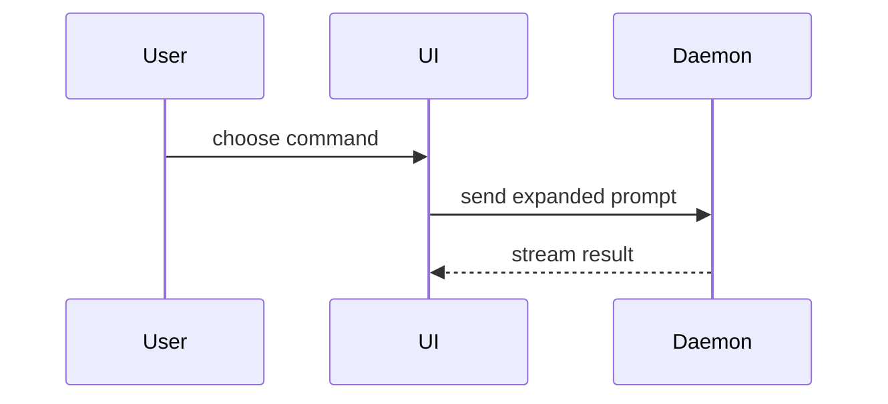

Explain the current topic. Skip the preamble. Budget: one lead-in sentence per
visual, at most three sentences outside blocks, one visual per question unless
the user asks for more. Include only the calls, files, props, states, and
boundaries needed to answer it.

Precedence: if the active agent defines a communication or diagram style,
it wins over this skill. Mermaid fences render natively in the OpenCode TUI,
so use them freely; HTML artifacts still need an explicit user request or a
confirmed rendered target.

Every code-shaped artifact goes in a fenced block — source code, pseudocode,
diffs, commands, configuration, logs, trees, diagram syntax — using the most
specific fence language available (`ts`, `tsx`, `diff`, `bash`, `json`,
`mermaid`); `text` when none fits. Explanation sits immediately before or
after the block, never inside it.

Pick the medium from the question being answered:

```text
question                        smallest medium
what changed                    diff
who calls whom, in what order   call tree
what lives where                component / file tree
which branch runs               pseudocode or control-flow diff
flow, sequence, state           mermaid fence
timing, profile, memory         ascii-diagrams skill
visual UI, dense concept        HTML artifact (request only)
```

If two shapes fit, pick the smaller; never stack views answering the same
question.

- Fresh logic with no delta to show, as pseudocode:

```text
on(message)
  if sender is muted
    return
  route to channel
  notify mentioned users
```

- Runtime control flow as a call tree:

```text
submitForm
  createSession
    persistPrompt
    launchAgent
  navigateToSession
```

- UI structure with the boundaries that matter, as a component tree:

```tsx
<SessionPage> (apps/example/src/routes/session.tsx)
  useSessionEvents()
  <SessionToolbar>
    <RunSkillButton> (packages/ui)
```

- File responsibility or a broad refactor, as a shallow file tree:

```text
src/
├── commands/       # parses user actions
├── sessions/       # owns session state
└── transport/      # sends API requests
```

- When the point is the delta and the surrounding shape already exists, show a `diff` matched to the topic.

Component change:

```diff
 <SessionPage>
   useSessionEvents()
   <SessionToolbar>
+    <RunSkillButton />
   <SessionTimeline>
+    <SkillResultCard />
```

Call-tree change:

```diff
 submitForm
   createSession
     persistPrompt
+    expandSkillMention
     launchAgent
-  navigateToSession
+  navigateToSession
+    subscribeToEvents
```

State or control-flow change:

```diff
 on(save)
-  write content
+  if content is unchanged
+    return cached result
+  write content
+  invalidate cache
```

- Show the whole block instead of a diff when most of it is new, omitted context would hide ownership or order, or the user needs a copyable target shape:

```ts
function expandSkill(command: string): string {
  const skillName = command.slice(1)
  return `use the ${skillName} skill`
}
```

- Sequential flow across participants, as a Mermaid sequence diagram:



- Visual UI, layout, state comparison, or concept too dense for text: write one focused HTML file — diagram, infographic, or short slide deck — matching the product's colors, type, spacing, and components; use real labels and data; support desktop and mobile. Then open it: `Bash(open path/to/explain-{description}.html)`.
